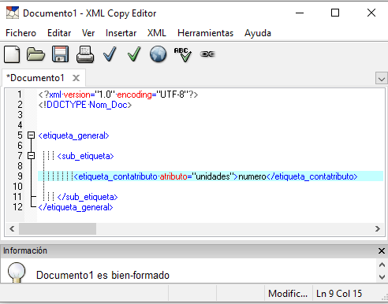
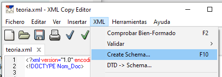
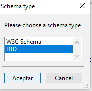
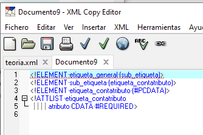
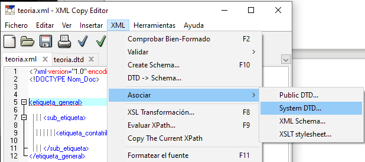
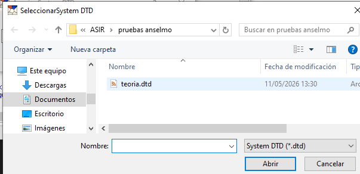
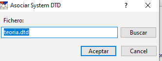
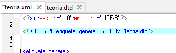
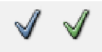

## De XML a DTD

Base XML

---

---

---

---

---

---

NO rutas absolutas

---

**REVISAR ASOCIACION**

---

## `<!ELEMENT>`

| **Categoría**           | **Sintaxis DTD**         | **Descripción**                                                  |
| ----------------------- | ------------------------ | ---------------------------------------------------------------- |
| **Terminal (Hojas)**    | `<!ELEMENT A (#PCDATA)>` | Solo contiene datos de tipo carácter (texto plano).              |
| **Vacío**               | `<!ELEMENT A EMPTY>`     | El elemento no puede contener ni texto ni otros elementos.       |
| **Cualquiera**          | `<!ELEMENT A ANY>`       | Puede albergar cualquier tipo de contenido.                      |
| **No Terminal (Ramas)** | `<!ELEMENT A (B, C)>`    | Contiene otros elementos hijos (secuencia obligatoria de B y C). |

 
 
 

| **Operador**            | **Significado**                                                                             | **Ejemplo en DTD**                             | **Explicación del Ejemplo**                                                              |
| ----------------------- | ------------------------------------------------------------------------------------------- | ---------------------------------------------- | ---------------------------------------------------------------------------------------- |
| **`,` (Coma)**          | **Secuencia:** Los elementos deben aparecer en el orden exacto indicado.                    | `<!ELEMENT alumno (nombre, direccion)>`        | El XML debe tener un `<nombre>` y después una `<direccion>` obligatoriamente.            |
| **`?` (Interrogación)** | **Opción:** El elemento es opcional; puede aparecer **0 o 1 vez**.                          | `<!ELEMENT telefono (trabajo?, casa)>`         | El teléfono puede incluir el lugar de `<trabajo>` o no, pero la `<casa>` es obligatoria. |
| **`+` (Símbolo más)**   | **Uno o más:** El elemento es obligatorio y puede **repetirse**.                            | `<!ELEMENT biblioteca (libro+)>`               | La biblioteca debe contener, como mínimo, un `<libro>`, pero puede tener muchos más.     |
| **`*` (Asterisco)**     | **Cero o más:** El elemento es opcional y puede **repetirse**.                              | `<!ELEMENT provincia (nombre, (cp, ciudad)*)>` | Puede aparecer el `<nombre>` solo, o seguido de varios pares de `<cp>` y `<ciudad>`.     |
| \|                      | \| (Barra vertical): Operador de elección; se debe elegir uno de los elementos de la lista. | `<!ELEMENT contacto (persona\|perro)>`         | **Elección:** Se debe elegir **solo uno** de los elementos de la lista.                  |

---

## `<!ATTLIST>`

Atributos que tiene un elemento

**Sintaxis:** `<!ATTLIST nombre_elemento        nombre_atributo      TIPO + MODIFICADOR>`.

### TIPO

| **Tipo de Dato** | **Descripción**                                                                 | **Ejemplo en DTD**                                          | **Ejemplo en XML**             |
| ---------------- | ------------------------------------------------------------------------------- | ----------------------------------------------------------- | ------------------------------ |
| **CDATA**        | Cadena de caracteres (texto plano) que no será analizada en busca de etiquetas. | `<!ATTLIST alumno edad CDATA #REQUIRED>`                    | `<alumno edad="15"/>`          |
| **ID**           | Identificador único. No puede empezar por números ni contener espacios.         | `<!ATTLIST alumno dni ID #REQUIRED>`                        | `<alumno dni="a12345678z"/>`   |
| **IDREF**        | Referencia al valor de un atributo de tipo `ID` ya existente en el documento.   | `<!ATTLIST matricula ref IDREF #REQUIRED>`                  | `<matricula ref="0101LVF"/>`   |
| **NMTOKEN**      | El valor debe ser una única palabra que cumpla las reglas de nombres de XML.    | `<!ATTLIST curso codigo NMTOKEN #IMPLIED>`                  | `<curso codigo="LMSGI_2024"/>` |
| **Enumeración**  | Lista cerrada de valores posibles separados por `\|`.                           | `<!ATTLIST fecha dia (lunes\|martes\|miercoles) #REQUIRED>` | `<fecha dia="lunes"/>`         |

### MODIFICADOR

- **`#REQUIRED`:** El atributo es obligatorio.
- **`#IMPLIED`:** El atributo es opcional.
- **`#FIXED "valor"`:** El atributo tiene un valor constante que no puede cambiarse.
- **`"valor_por_defecto"`:** Valor que toma el atributo si no se especifica explícitamente.

| **Modificador**             | **Descripción**                                                                       | **Ejemplo en DTD**                             | **Comportamiento en XML**                              |
| --------------------------- | ------------------------------------------------------------------------------------- | ---------------------------------------------- | ------------------------------------------------------ |
| **`#REQUIRED`**             | El atributo es **obligatorio**. Si no aparece, el documento no es válido.             | `<!ATTLIST alumno edad CDATA #REQUIRED>`       | Obliga a poner: `<alumno edad="20">`.                  |
| **`#IMPLIED`**              | El atributo es **opcional**. No es necesario que aparezca en el documento.            | `<!ATTLIST alumno sexo CDATA #IMPLIED>`        | Permite poner: `<alumno>`.                             |
| **`#FIXED "valor"`**        | El atributo tiene un **valor constante**. Siempre vale lo mismo, se escriba o no.     | `<!ATTLIST pais nombre CDATA #FIXED "España">` | Si se pone, solo puede ser: `nombre="España"`.         |
| **`"valor"` (Por defecto)** | Si el atributo no se escribe, el procesador le asigna este **valor automáticamente**. | `<!ATTLIST socio tipo CDATA "estandar">`       | Si se escribe `<socio>`, se asume que es `"estandar"`. |

### Sobre el archivo XML se busca que esté bien formado y validado

