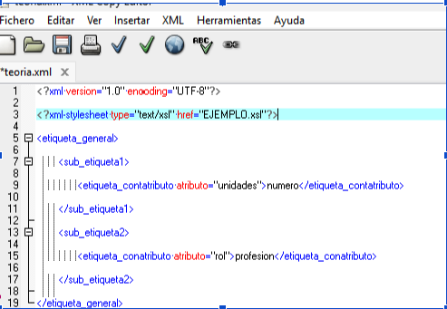
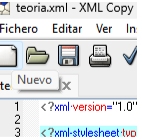
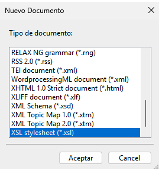
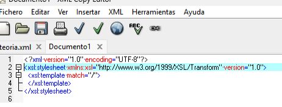
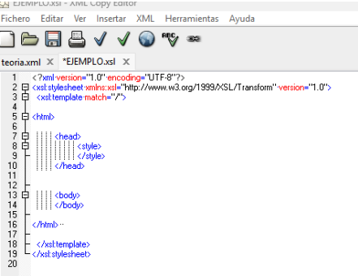
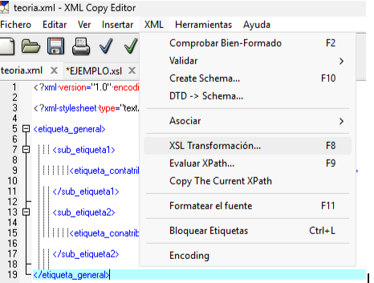
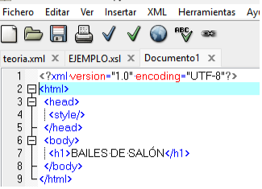
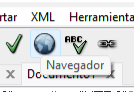

## Introducción a XSL

Creación de XML BASE

> **IMPORTANTE:** `<?xml-stylesheet type="text/xsl" href="EJEMPLO.xsl"?>`




---

Creación XSL






---

Creamos y guardamos con el mismo nombre indicado en el XML



---

Se trabaja con este documento que da las intrucciones de los datos XML



---

Transformación



>**Este es el paso donde le programa da problemas**

---

Se genera este documento



Dado que habrá que ir modificando el XSL para maquetar la información lo generaremos muchas veces.

---

Ver en navegador pulsando el icono desde el programa



>**Una vez el resultado sea el DOCUMENTO DESEADO lo guardaremos como HTML**


## Estructura básica de un documento XSLT

```xml
<?xml version="1.0" encoding="UTF-8"?>
<xsl:stylesheet version="1.0" xmlns:xsl="http://www.w3.org/1999/XSL/Transform">
  <xsl:output method="html" encoding="UTF-8" indent="yes"/>

  <xsl:template match="/">
    <html>
      <body>
        <xsl:apply-templates/>
      </body>
    </html>
  </xsl:template>

</xsl:stylesheet>
```

### Elementos principales de XSLT

| **Elemento**                | **Descripción**                                   | **Ejemplo**                                                            |
| --------------------------- | ------------------------------------------------- | ---------------------------------------------------------------------- |
| **`<xsl:template>`**        | Define una plantilla con patrones de coincidencia | `<xsl:template match="/">AQUI_PLANTILLA</xsl:template>`                |
| **`<xsl:apply-templates>`** | Aplica plantillas a los nodos hijos               | `<xsl:apply-templates select="alumno"/>` este ya va cerrado            |
| **`<xsl:value-of>`**        | Extrae el valor de un nodo seleccionado           | `<xsl:value-of select="nombre"/>`                                      |
| **`<xsl:for-each>`**        | Bucle sobre un conjunto de nodos                  | `<xsl:for-each select="alumno">La cosa que se repite para cada alumno` |
| **`<xsl:if>`**              | Condicional simple                                | `<xsl:if test="edad > 18">`                                            |
| **`<xsl:choose>`**          | Condicional múltiple (como switch/case)           | `<xsl:choose>` con `<xsl:when>` y `<xsl:otherwise>`                    |
| **`<xsl:sort>`**            | Ordena los nodos seleccionados                    | `<xsl:sort select="nombre" order="ascending"/>`  `(descending)`        |
| **`<xsl:variable>`**        | Define una variable                               | `<xsl:variable name="total" select="sum(precio)"/>`                    |
| **`<xsl:text>`**            | Inserta texto literal                             | `<xsl:text>Ejemplo: </xsl:text>`                                       |
| **`<xsl:copy-of>`**         | Copia nodos o fragmentos                          | `<xsl:copy-of select="direccion"/>`                                    |

---

## XPath

XPath es el lenguaje que permite navegar y seleccionar nodos dentro de un documento XML.

### Sintaxis básica de XPath

| **Expresión** | **Descripción**                                         | **Ejemplo**                    |
| ------------ | ------------------------------------------------------- | ------------------------------ |
| `/`          | Selección desde el nodo raíz                            | `/empresa`                     |
| `//`         | Selección de cualquier nodo descendiente                | `//alumno`                     |
| `.`          | Nodo actual                                             | `./nombre`                     |
| `..`         | Nodo padre                                              | `../direccion`                 |
| `@`          | Selecciona atributos                                    | `@dni` o `alumno/@dni`        |
| `*`          | Comodín: cualquier nodo                                 | `alumno/*`                     |
| `node()`     | Selecciona cualquier tipo de nodo                       | `alumno/node()`                |
| `text()`     | Selecciona el contenido de texto                        | `nombre/text()`                |

### Predicados XPath (filtros)

| **Predicado**         | **Descripción**                             | **Ejemplo**                |
| --------------------- | ------------------------------------------- | -------------------------- |
| `[n]`                 | Selecciona el nodo en posición n. Inicio 1  | `alumno[2]`                |
| `[primero]`           | Selecciona el primero que cumple condición  | `alumno[nombre='Ana']`     |
| `[last()]`            | Selecciona el último nodo                   | `alumno[last()]`           |
| `[position() < n]`    | Selecciona nodos por posición               | `alumno[position() < 5]`   |
| `[@atributo]`         | Selecciona nodos que tienen atributo        | `alumno[@dni]`             |
| `[@atributo='valor']` | Selecciona nodos con atributo igual a valor | `alumno[@estado='activo']` |

### Operadores XPath

| **Operador** | **Descripción**      | **Ejemplo**                  |
| ------------ | -------------------- | ---------------------------- |
| `+`          | Suma                 | `precio + descuento`         |
| `-`          | Resta                | `nota - 1`                   |
| `*`          | Multiplicación       | `precio * cantidad`          |
| `div`        | División             | `total div 2`                |
| `mod`        | Módulo (resto)       | `nota mod 2`                 |
| `=`          | Igual                | `nombre = 'Ana'`             |
| `!=`         | Distinto             | `estado != 'inactivo'`       |
| `<`, `>`, `<=`, `>=` | Comparación | `edad > 18`                  |
| `and`        | Conjunción lógica     | `edad > 18 and sexo = 'M'`   |
| `or`         | Disyunción lógica     | `ciudad = 'Madrid' or ciudad = 'Barcelona'` |

### Funciones XPath


| **Función**                | **Descripción**                        | **Ejemplo**                                                                     |
| -------------------------- | -------------------------------------- | ------------------------------------------------------------------------------- |
| `count(nodos)`             | Cuenta el número de nodos              | `count(alumno)`                                                                 |
| `sum(nodos)`               | Suma los valores numéricos             | `sum(notas)`                                                                    |
| `avg(nodos)`               | Calcula la media                       | `avg(notas)`                                                                    |
| `min(nodos)`               | Valor mínimo                           | `min(notas)`                                                                    |
| `max(nodos)`               | Valor máximo                           | `max(notas)`                                                                    |
| `string-length(texto)`     | Longitud de una cadena                 | `string-length(nombre)`                                                         |
| `contains(texto,busca)`    | Comprueba si contiene una coincidencia | `contains(nombre, 'Pepe')`                                                      |
| `starts-with(texto,busca)` | Comprueba si empieza con               | `starts-with(nombre, 'A')`                                                      |
| `concat(texto1,texto2)`    | Concatena cadenas                      | `concat(nombre, ' ', apellido)`                                                 |
| `position()`               | Posición del nodo actual               | `alumno[position() = 1]`                                                        |
| `last()`                   | Posición del último nodo               | `alumno[last()]`                                                                |
| `normalize-space()`        | Elimina espacios                       | `normalize-space(nombre)`                                                       |
| `translate()`              | traduce un valor en otro               | `translate(elemento-a-usar,'busca elemento usado', 'equivalente a reemplazar')` |


---

## XSLT: Ejemplos de código

### Ejemplo 1: Transformación básica XML a HTML

**XML de entrada:**
```xml
<?xml version="1.0" encoding="UTF-8"?>


<?xml-stylesheet type="text/xsl" href="RUTA_ARCHIVO_RELATIVA.xsl"?>


<empresa>
  <nombre>TechCorp S.L.</nombre>
  <empleados>
    <empleado>
      <nombre>Ana García</nombre>
      <cargo>Desarrollador</cargo>
      <salario>35000</salario>
    </empleado>
    <empleado>
      <nombre>Carlos López</nombre>
      <cargo>Diseñador</cargo>
      <salario>30000</salario>
    </empleado>
  </empleados>
</empresa>
```

**XSLT:**
```xml
<?xml version="1.0" encoding="UTF-8"?>
<xsl:stylesheet version="1.0" xmlns:xsl="http://www.w3.org/1999/XSL/Transform">
  <xsl:output method="html" encoding="UTF-8" indent="yes"/>

  <xsl:template match="/">
    <html>
      <head>
        <title>Empleados</title>
        <style>
          table { border-collapse: collapse; width: 100%; }
          th, td { border: 1px solid black; padding: 8px; text-align: left; }
          th { background-color: #4CAF50; color: white; }
        </style>
      </head>
      <body>
        <h1>Empresa: <xsl:value-of select="empresa/nombre"/></h1>
        <h2>Lista de Empleados</h2>
        <table>
          <tr>
            <th>Nombre</th>
            <th>Cargo</th>
            <th>Salario</th>
          </tr>
          <xsl:for-each select="empresa/empleados/empleado">
            <xsl:sort select="nombre" order="ascending"/>
            <tr>
              <td><xsl:value-of select="nombre"/></td>
              <td><xsl:value-of select="cargo"/></td>
              <td><xsl:value-of select="salario"/> €</td>
            </tr>
          </xsl:for-each>
        </table>
        <p>Total empleados: <xsl:value-of select="count(empresa/empleados/empleado)"/></p>
        <p>Media salarial: <xsl:value-of select="sum(empresa/empleados/empleado/salario) div count(empresa/empleados/empleado)"/> €</p>
      </body>
    </html>
  </xsl:template>

</xsl:stylesheet>
```

### Ejemplo 2: Condicionales

```xml
<xsl:stylesheet version="1.0" xmlns:xsl="http://www.w3.org/1999/XSL/Transform">

  <xsl:template match="alumno">
    <div class="alumno">
      <h3><xsl:value-of select="nombre"/></h3>
      <xsl:if test="edad >= 18">
        <p class="adulto">Es mayor de edad</p>
      </xsl:if>
      <xsl:choose>
        <xsl:when test="nota >= 9">
          <p class="excelente">Sobresaliente</p>
        </xsl:when>
        <xsl:when test="nota >= 7">
          <p class="notable">Notable</p>
        </xsl:when>
        <xsl:when test="nota >= 5">
          <p class="aprobado">Aprobado</p>
        </xsl:when>
        <xsl:otherwise>
          <p class="suspenso">Suspenso</p>
        </xsl:otherwise>
      </xsl:choose>
    </div>
  </xsl:template>

</xsl:stylesheet>
```

### Ejemplo 3: Plantillas con match y select

```xml
<xsl:stylesheet version="1.0" xmlns:xsl="http://www.w3.org/1999/XSL/Transform">

  <xsl:template match="/">
    <html>
      <body>
        <xsl:apply-templates select="biblibros/titulo"/>
        <xsl:apply-templates select="biblibros/libro"/>
      </body>
    </html>
  </xsl:template>

  <xsl:template match="titulo">
    <h1><xsl:value-of select="."/></h1>
  </xsl:template>

  <xsl:template match="libro">
    <div class="libro">
      <p><strong>Título:</strong> <xsl:value-of select="titulo"/></p>
      <p><strong>Autor:</strong> <xsl:value-of select="autor"/></p>
      <xsl:if test="@anyo">
        <p><strong>Año:</strong> <xsl:value-of select="@anyo"/></p>
      </xsl:if>
    </div>
  </xsl:template>

</xsl:stylesheet>
```


